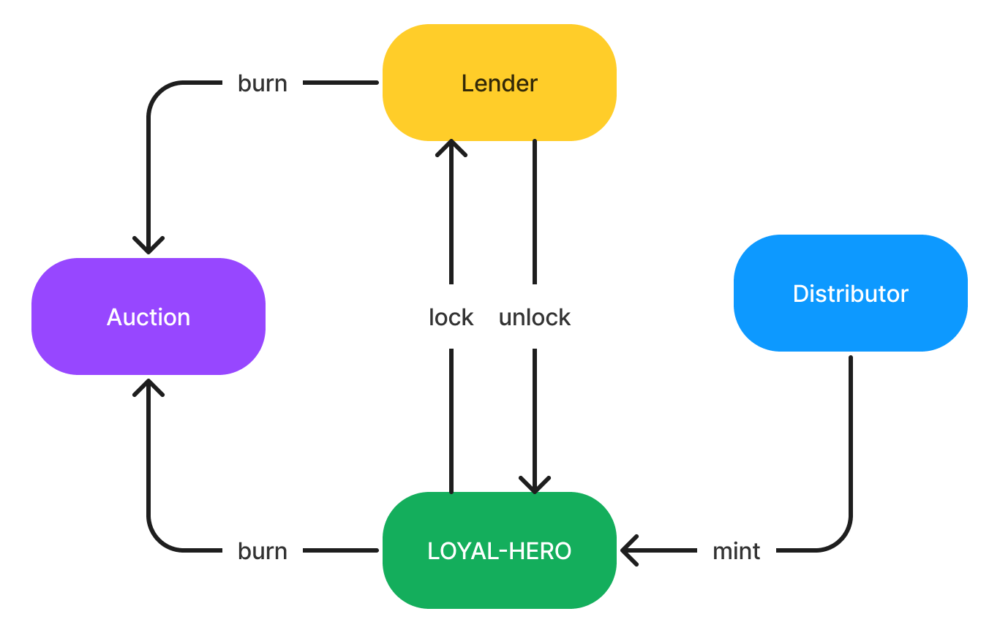

# Metahero Loyalty Token

* Standard - [ERC-721](https://github.com/ethereum/EIPs/blob/master/EIPS/eip-721.md)
* Name - `Metahero Loyalty`
* Symbol - `LOYAL-HERO`

## Additional token properties

* `snapshot id` (based on the timestamp of mining)
* `deposit` locked in the token
* `invitation rewards` locked in the token
* `weight` that is used to calculate snapshot rewards 
* `unlock withdrawal timestamp`

## Snapshot system

First snapshot starts on contract initialization. Snapshot window length is predefined.

Each snapshot contains:
* latest sum of total tokens weights in the snapshot
* amount of total rewards captured in the snapshot

## Rewards

There are two types of rewards:
* `Invitation rewards` are calculated and attached to the token during the process of using the invitation.
* `Snapshot rewards` are sum of all rewards from snapshot higher than token snapshot id. Each snapshot rewards is calculated separately and proportionally to token weight.

Both rewards can be withdrawn after `unlock withdrawal timestamp`.

## Burning

If token burring is requested before `unlock withdrawal timestamp`:

* all collected rewards are removed from the token and goes to current snapshot rewards,
* additional predefined tax is added to withdrawal amount (deposit)

If after, all collected rewards and deposit are send to token owner.

Burned token is automatically send to auction.

## Modules

### Distributor

The token is distributed on an invitation basis. Each invitation has:

* [merkle root](https://en.wikipedia.org/wiki/Merkle_tree) hash of all invited accounts
* min and max required deposit
* min and max deposit APY
* min and max withdrawal lock time
* deposit power - used to calc token weight

When using the invitation, the user selects the withdrawal lock time. 
The APY on the deposit is proportional to the time of the lock time and is used to calculate invitation rewards.

### Auction

All burned tokens go to auction. The deposit value of the burnt token becomes the min offer. The auction time is predefined and starts with the first bid.

After winning the auction, the difference between the deposit and the offer goes to current snapshot rewards,

The withdrawal lock time is predefined. It is reduced in proportion to the deposit surplus (if the offer exceeds twice the deposit, it is zero)

### Lender

(TODO)
